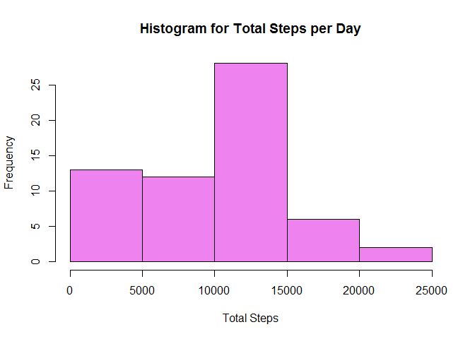
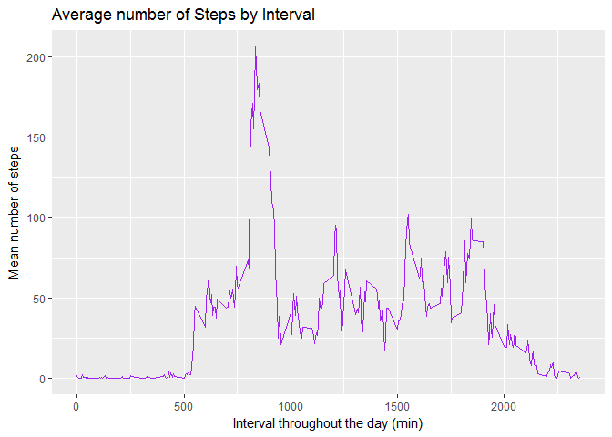
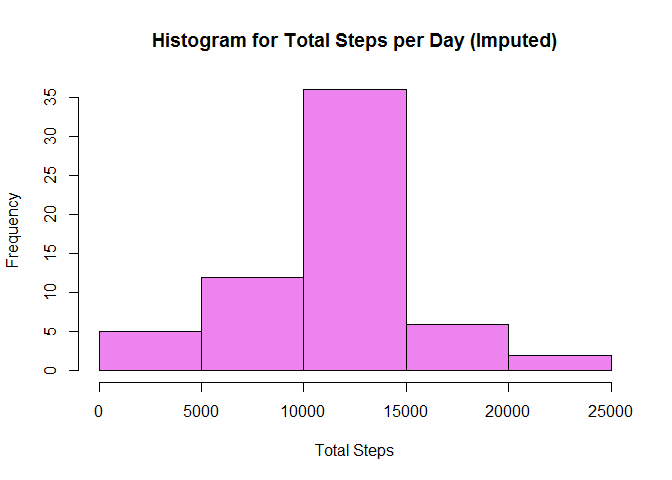
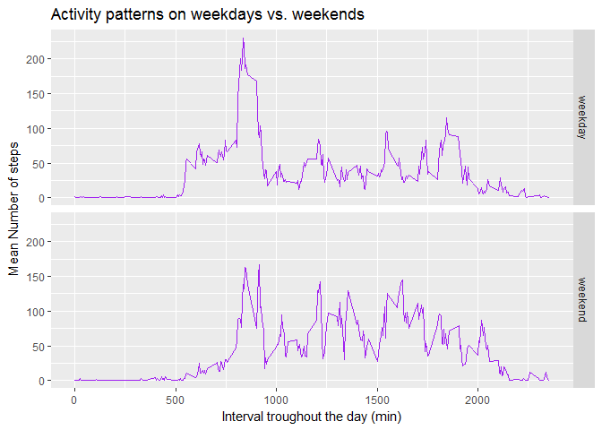

# Reproducible Research: Peer Assessment 1

## Library
Load the libraries needed. Option `quiet=T` added so that no message confirming package attaching is printed, and most often, no errors/warnings are printed if package attaching fails.


```r
library(plyr, quiet=T)
library(ggplot2, quiet=T)

library(knitr, quiet=T)
opts_chunk$set(dev="png", fig.path="figure/")
```

## Loading and preprocessing the data

Read `activity.csv` file. First line is header.


```r
activity <- read.csv("activity.csv", header = T, colClasses=c("numeric", "character", "numeric"),
                     stringsAsFactors=F)
```

Changed date colomn as Date with format `"%Y-%m-%d"`


```r
activity$date <- as.Date(activity$date, format="%Y-%m-%d")
```

## What is mean total number of steps taken per day?

Calculate total of steps per day. The totalSteps is grouped by date.


```r
totalStepsPerDay <- ddply(activity, .(date), summarize, totalSteps=sum(steps, na.rm=T))
```

Total Steps per day displayed in **histogram**:


```r
hist(totalStepsPerDay$totalSteps, col="violet", main="Histogram for Total Steps per Day",
     xlab="Total Steps")
```

<!-- -->

Calculate **mean** and **median** of total steps per day.


```r
# calculate mean
meanOfTotalStepsPerDay <- mean(totalStepsPerDay$totalSteps)
meanOfTotalStepsPerDay
```

```
## [1] 9354.23
```


```r
# calculate median
medianOfTotalStepsPerDay <- median(totalStepsPerDay$totalSteps)
medianOfTotalStepsPerDay
```

```
## [1] 10395
```

## What is the average daily activity pattern?

Make a time series plot (i.e. `type = "l"`) of the 5-minute interval (x-axis) and the average number of steps taken, averaged across all days (y-axis)


```r
averageStepsPerInterval <- 
  ddply(activity, "interval", summarize, mean=mean(steps, na.rm=TRUE))

g <- ggplot(averageStepsPerInterval, aes(interval, mean))
g + geom_line(color="purple") + labs(title="Average number of Steps by Interval", x="Interval throughout the day (min)", y="Mean number of steps")
```

<!-- -->

Find interval that contains maximum number of steps.


```r
intervalWithMaxSteps <- averageStepsPerInterval$interval[which.max(averageStepsPerInterval$mean)]
intervalWithMaxSteps
```

```
## [1] 835
```

## Imputing missing values

How many rows have missing values? We can get the answer by calculating total of rows which have `NA'.


```r
nRowsMissingValues <- sum(!complete.cases(activity))
nRowsMissingValues
```

```
## [1] 2304
```

We will fill missing values for the total steps with the mean number for that interval. Following function is used as a helper.


```r
FillMissingValuesWithMean <- function(steps, interval) {
    if (is.na(steps)) {
        averageStepsPerInterval[averageStepsPerInterval$interval==interval,]$mean
    } else {
        steps
    }
}
```

After that, we will create a new dataset that is equal to the original dataset but with the missing data filled in.


```r
imputedActivity <- activity
imputedActivity$steps <- mapply(FillMissingValuesWithMean, activity$steps, activity$interval)
```

Make a **histogram** of the total number of steps taken each day.


```r
totalStepsPerDayForImputedActivity <- 
  ddply(imputedActivity, .(date), summarize, totalSteps=sum(steps, na.rm=T))

hist(totalStepsPerDayForImputedActivity$totalSteps, col="violet", 
     main="Histogram for Total Steps per Day (Imputed)",
     xlab="Total Steps")
```

<!-- -->

Calculate and report the **mean** and **median** total number of steps taken per day. 


```r
# calculate mean
mean(totalStepsPerDayForImputedActivity$totalSteps)
```

```
## [1] 10766.19
```


```r
# calculate median
median(totalStepsPerDayForImputedActivity$totalSteps)
```

```
## [1] 10766.19
```

Do these values differ from the estimates from the first part of the assignment? **Yes**. In this case, imputing missing data increases mean and median.

## Are there differences in activity patterns between weekdays and weekends?

Create a new factor variable in the dataset with two levels - "weekday" and "weekend" indicating whether a given date is a weekday or weekend day.


```r
LabelDayWithWeekendOrWeekday <- function(date) {
  if (weekdays(date) %in% c("Saturday", "Sunday")) "weekend" else "weekday"
} 
    
imputedActivity$daytype <- as.factor(sapply(imputedActivity$date, LabelDayWithWeekendOrWeekday))
```

Make a panel plot containing a time series plot (i.e. `type = "l"`) of the 5-minute interval (x-axis) and the average number of steps taken, averaged across all weekday days or weekend days (y-axis). 


```r
stepsByDayType <- ddply(imputedActivity, .(interval, daytype),summarize, steps=mean(steps))

gg <- ggplot(stepsByDayType, aes(interval, steps)) 
gg + geom_line(color="purple") + facet_grid(daytype ~ .) +
    labs(x="Interval troughout the day (min)", y="Mean Number of steps", title="Activity patterns on weekdays vs. weekends")
```

<!-- -->
